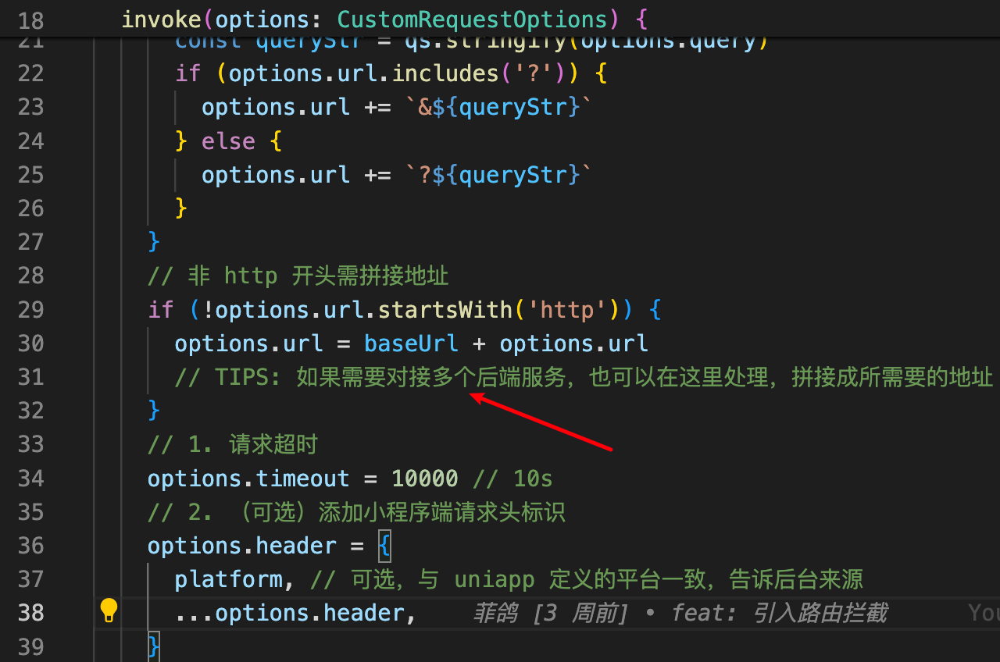

# Proxy

之前默认的后台地址只有一个，地址也是在 `.env` 里面进行配置的。但是如果后台地址有多个，那就不方便了。

多个后台地址时，通常有 `2` 个方案：

- 1. ~~使用 `proxy 代理` ，将请求转发到不同的后台地址。~~ （仅 `H5端` 可用，其他端不行，不推荐）
- 2. 编写多个 `http 实例`，每个实例传入不同的后台地址。
- 3. 拦截器里面针对不同后端服务，做映射。（推荐）

::: warning
对于第 1 种，因为 `非H5端` 会走 `build`，不走本地代理，所以配置的 `devServer` 的 `proxy` 不生效。
:::

这里只介绍第三种，需要修改的地方就为 `src/interceptors/request.ts` 的一处。



```ts {17}
// 可以写一个映射对象，如：
const proxyMap = {
  cms:'http://localhost:8080/cms',
  ums:'http://localhost:8080/ums',
}

// 拦截器部分修改如下
Object.keys(proxyMap).forEach(key=>{
  if(options.url.startsWith(`/${key}`)){
    options.url = proxyMap[key] + options.url
  }
}

// 接口调用的地方使用如下格式：
// export const getFooAPI = (name: string) => {
//   return http<IFooItem>({
//     url: `/cms/foo`, // 看这里！！！
//     method: 'GET',
//     query: { name },
//   })
// }
```

代码仅供参考，可以自行修改。
