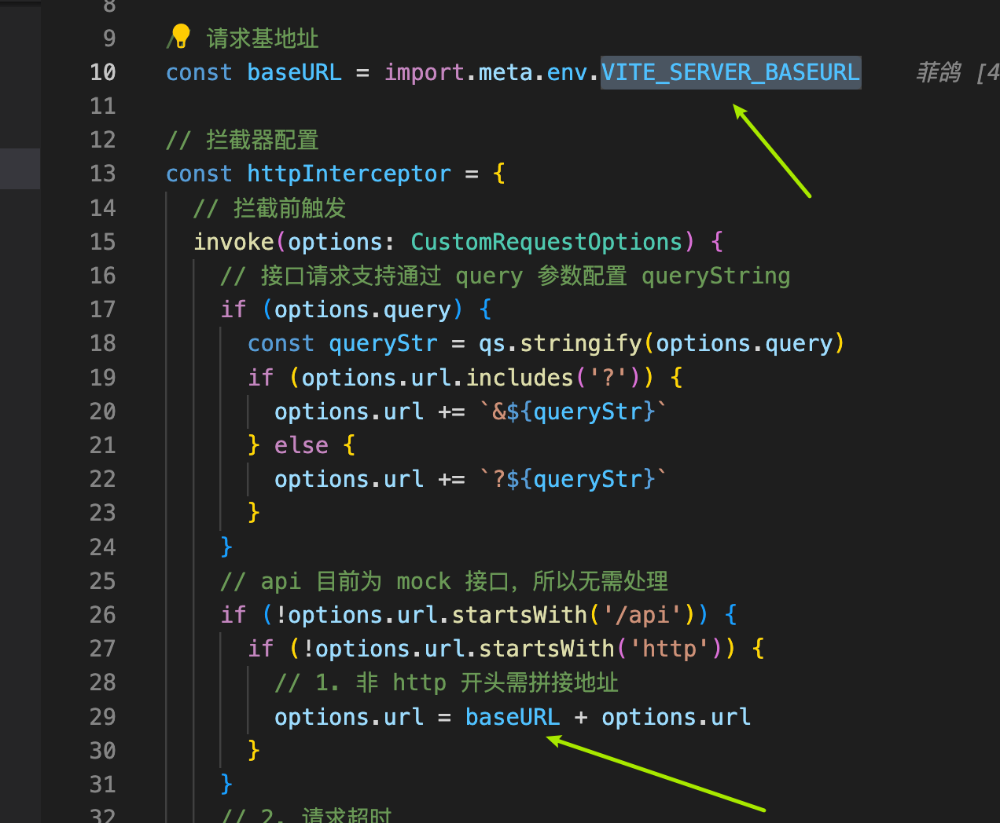

# Proxy

之前默认的后台地址只有一个，地址也是在 `.env` 里面进行配置的。但是如果后台地址有多个，那就不方便了。

多个后台地址时，通常有 `2` 个方案：

- 1. 编写多个 `http 实例`，每个实例传入不同的后台地址。
- 2. 使用 `proxy 代理` ，将请求转发到不同的后台地址。（推荐）

**这里只介绍第二种方案。**

`proxy 代理` 又分为 `本地代理` 和 `线上代理`，分别使用 `vite proxy` 和 `nginx` 配置来完成。

## 本地代理

`vite.config.ts` 的 `proxy` 配置如下。

`/basic-api` 代表需要命中的 `path`，`target` 是请求转发到的地址，`rewrite` 是重写 `path`（下面是把 `/basic-api` 替换为空）。

当请求 `/basic-api/user` 时，实际请求的地址是 `http://localhost:3000/user`。

```ts
 server: {
      proxy: {
        '/basic-api': {
          target: 'http://localhost:3000',
          changeOrigin: true,
          ws: true,
          rewrite: (path) => path.replace(new RegExp(`^/basic-api`), ''),
          // only https
          // secure: false
        },
        '/upload': {
          target: 'http://localhost:3300/upload',
          changeOrigin: true,
          ws: true,
          rewrite: (path) => path.replace(new RegExp(`^/upload`), ''),
        },
      },
      open: true, // 项目启动后，自动打开
      warmup: {
        clientFiles: ['./index.html', './src/{views,components}/*'],
      },
    },
```

::: tip
优化点：上面配置里转发的 `target` 可以通过 `.env` 配置。
:::

## 代码变更

通过代理的方式，需要把请求拦截里面的 `url 拼接` 去掉，有 2 种方式：

- 1.把 `.env` 文件里的 `VITE_SERVER_BASEURL` 设置为空字符串。
- 2.把 `url` 拼接去掉，注释掉第 29 行代码。



:::tip
`unibest` 在 `v2.0.0` 时已经内置，无需处理。
:::

## 线上代理

使用 `nginx` 配置代理即可。
