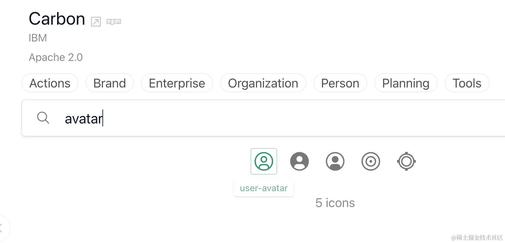
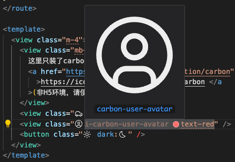

# 图标

有 3 种方式使用图标：

- 使用引入的 `UI 库` 的图标
- 使用 `iconify` 图标库
- 使用 `iconfont` 图标库
- 其他图标库

## UI 库的图标

如 `wot-ui` 的 `wd-icon` 组件，其中颜色可以通过 `color` 配置或 `unocss class` 设置。

```vue
<wd-icon name="add-circle" color="red"></wd-icon>
<wd-icon class="text-green" name="add-circle"></wd-icon>
<!-- color 和 unocss class 同时存在时以 color 为优先 -->
<wd-icon class="text-green" name="add-circle" color="red"></wd-icon>
```

::: tip
`wot-ui` 全称 `wot-design-uni`，是 `wot-design` 的 `uniapp` 版本。文档地址见：[https://wot-design-uni.gitee.io/](https://wot-design-uni.gitee.io/)
:::

## iconify 图标库

`iconfiy` 图标库拥有 `10万+` 的海量图标，总能找到你想要的。

### 安装 iconify

在使用 `iconify` 之前需要安装对应的图标库，安装格式如下：

`pnpm i -D @iconify-json/[the-collection-you-want]`

以安装 `carbon` 为例，执行 `pnpm i -D @iconify-json/carbon` 即可。

::: tip
`unibest` 已经装好了 `carbon` 图标库，可以直接使用。
:::

### 使用 iconify

打开网址：[https://icones.js.org/](https://icones.js.org/)

- 在里面找到某个库，如 `carbon`
  

- 搜索想要的图表，如 `avatar`，出现的搜索结果，查看类名，也可以点击图标，会出现详情

::: tip
也可以直接全局搜索，而非在某个图标库里面搜索。
:::




- 如上图，拿到 `carbon:user-avatar`
- 代码里面 `class` 填写 `i-carbon-user-avatar` 并且支持改颜色



::: tip
如果图标没有预览效果，请安装 `VSCode` 插件 `antfu.iconify` ( 也是 `antfu` 大神的作品 )。
:::

## iconfont 图标库

`iconfont` 同样有海量免费的图标，同时支持上传自己的图标，公司的项目通常会使用 `iconfont`。

使用步骤：（TODO: white）

- `iconfont` 创建项目，并寻找图标，或者上传自己的图标。
- 拿到 iconfont 的链接，如 `https://at.alicdn.com/t/font_2507683_q49z1l`
- 代码中引入，并使用

## 其它图标库

字节跳动的 `IconPark`，链接 [https://iconpark.oceanengine.com/](https://iconpark.oceanengine.com/)。


不知道谁家的 `yesicon`，链接 [https://yesicon.app/](https://yesicon.app/)。

