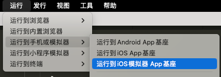
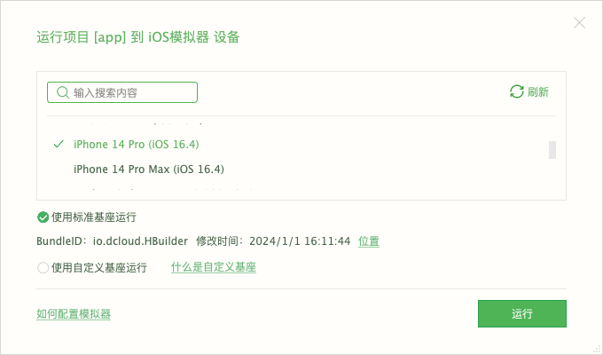
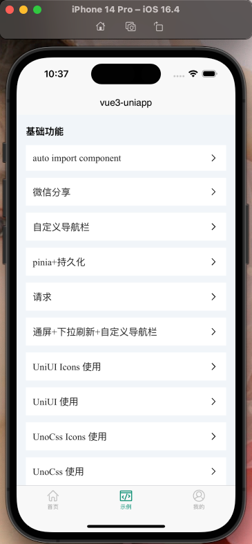
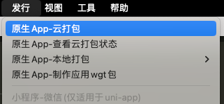

# 起步

## 前置依赖

- **Node.js** - `>=v18`
- **pnpm** - `>=7.30`（推荐使用 `8.15`）
- **文本编辑器** - 推荐使用 [VS Code](https://code.visualstudio.com/)
- **终端** - 为了运行 `uni` 命令，Windows 推荐 Git Bash，Linux 和 macOS 推荐 zsh

## 下载项目

目前已经开发了 `create-unibest`，用户可以通过 `pnpm create unibest <项目名>` 命令生成项目模版：

::: code-group

```bash [pnpm]
# pnpm create unibest <项目名>
pnpm create unibest my-unibest
```

:::

目前还支持 `-t` 参数选择模板，命令如 `pnpm create unibest <项目名> -t <模板名>`，目前已经内置了3个模板，分别是 `base`、`demo`、`i18n`。
```sh
# pnpm create unibest <项目名> -t <模板名>
pnpm create unibest my-unibest -t base # 基础模板
pnpm create unibest my-unibest -t i18n # 多语言模板
pnpm create unibest my-unibest -t demo # 所有demo的模板，还包含了i18n
```

<!-- - 如果想学习所有的 `demo`，可以通过 `pnpm create unibest my-unibest-demo -t demo` 生成。(包含了所有的 `demo` 和 `i18n` 代码)
- 如果是新开发一个项目，建议使用 `base` 模板，可以通过 `pnpm create unibest my-unibest -t base` 生成。（不含 `demo` 代码）
- 如果项目有多语言需求，建议使用 `i18n` 模板，可以通过 `pnpm create unibest my-unibest -t i18n` 生成。（不含 `demo` 代码） -->

## 安装依赖

::: code-group

```bash [pnpm]
pnpm i
```

:::

## 运行（支持热更新）

- `h5 平台`： `pnpm dev:h5`，然后浏览器打开 `http://localhost:9000/`。
- `wx 小程序`：`pnpm dev:mp-weixin`，然后打开微信开发者工具，导入本地文件夹，选择本项目的 `dist/dev/mp-weixin` 文件。

  

- `APP 平台`：`pnpm dev:app`，然后打开 `HBuilderX`，导入刚刚生成的 `dist/dev/app` 文件夹，选择运行到 `模拟器`( `开发时优先使用` )，或者 `运行到安卓/ios 基座` (真机调试时使用) 。

  
  

  下面是我的 `mac` 电脑的演示，`windows` 平台类似：（这样就有 `热更新` 效果）

  

  `MAC` `iOS` 模拟器如下：

  

## 发布

- `h5 平台`： `pnpm build:h5`，打包后的文件在 `dist/build/h5`，可以放到 web 服务器，如 nginx 运行。如果最终不是放在根目录，可以在 `manifest.config.ts` 文件的 `h5.router.base` 属性进行修改。
- `wx 小程序`：`pnpm build:mp-weixin`，打包后的文件在 `dist/build/mp-weixin`，然后通过微信开发者工具导入，并点击右上角的“上传”按钮进行上传。
- `APP 平台`：`pnpm build:app`，然后打开 `HBuilderX`，导入刚刚生成的 `dist/build/app` 文件夹，选择 `发行` - `原生APP-云打包`。

  

> 熟悉原生 APP 开发的开发者也可以使用 `原生APP-本地打包`。
