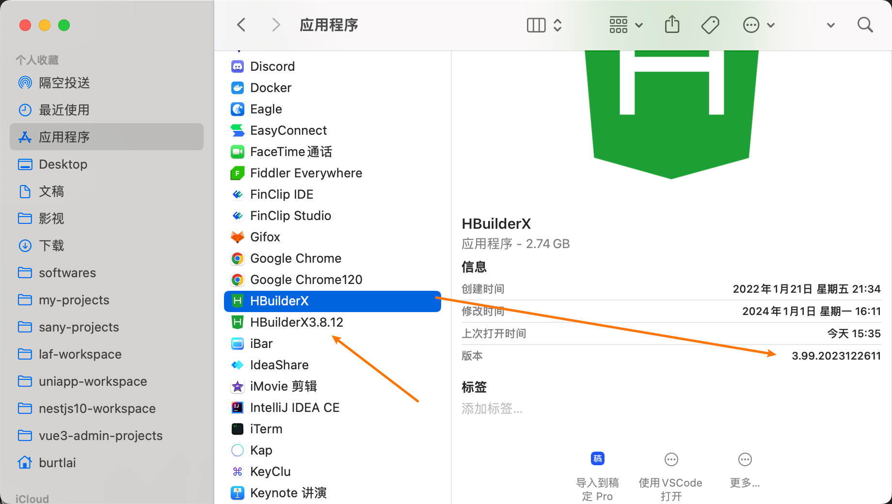

# 跨端开发

## 运行

- `h5 平台`： `pnpm dev:h5`（ 或者简单点 `pnpm dev` ），然后浏览器打开 `http://localhost:9000/`。
- `wx 小程序`：`pnpm dev:mp-weixin`，然后打开微信开发者工具，导入本地文件夹，选择本项目的 `dist/dev/mp-weixin` 文件。

  

- `APP 平台`：`pnpm dev:app`，然后打开 `HBuilderX`，导入刚刚生成的 `dist/dev/app` 文件夹，选择运行到 `模拟器`( `开发时优先使用` )，或者 `运行到安卓/ios 基座` (真机调试时使用) 。

  
  

:::tip

这样操作的话，开发时都会有热更新，开发体验很爽！

:::

## 发布

- `h5 平台`： `pnpm build:h5`，打包后的文件在 `dist/build/h5`，可以放到 web 服务器，如 nginx 运行。如果最终不是放在根目录，可以在 `manifest.config.ts` 文件的 `h5.router.base` 属性进行修改。
- `wx 小程序`：`pnpm build:mp-weixin`，打包后的文件在 `dist/build/mp-weixin`，然后通过微信开发者工具导入，并点击右上角的“上传”按钮进行上传。
- `APP 平台`：`pnpm build:app`，然后打开 `HBuilderX`，导入刚刚生成的 `dist/build/app` 文件夹，选择 `发行` - `原生APP-云打包`。

  

> 熟悉原生 APP 开发的开发者也可以使用 `原生APP-本地打包`。

## **APP 打包注意事项**

本模板使用的是 `3.8.12` 的库版本(`"@dcloudio/uni-app": "3.0.0-3081220230817001",`)，所以尽量使用 `3.8.12` 版本的 `HBuilderX` 来打包，否则可能有未知的风险，出现情况如下图。

点击 `ignore` 后可以正常使用，万一以后出现什么特殊情况，记得看看是不是版本问题。

> tips: mac 可以安装多个版本的软件，
> 

    
    本站总访问量次
    
    
    本站访客数人次
    
    
    本文总阅读量次
  

